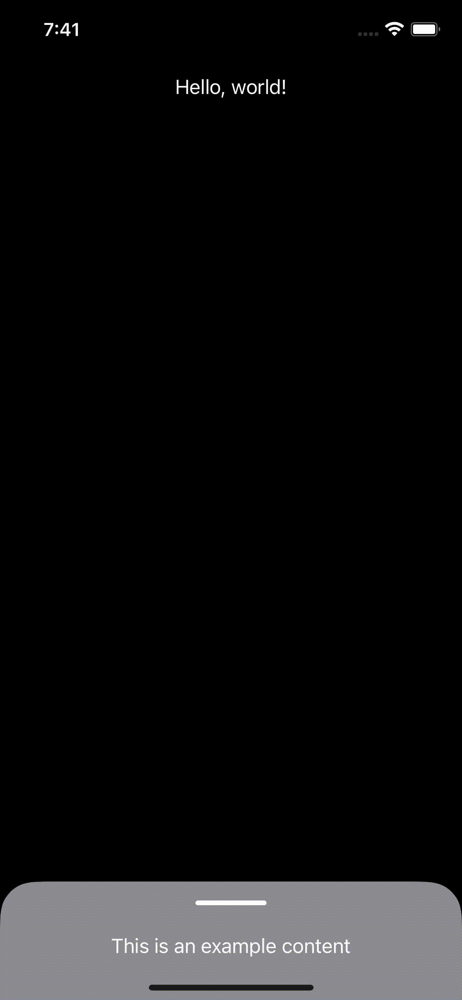

# BottomSheetSUI

BottomSheetSUI is a package that gives you the ability to show a Bottom sheet interactable, where you can add your own SwiftUI view. 

You can customize the detents available for the sheet. Small, Medium and Large. It will use just a set of them.

The project is inspired by the implementation of [UISheetPresentationController](https://developer.apple.com/documentation/uikit/uisheetpresentationcontroller) in UIKit to make it available for SwiftUI.

It is also inspired by the content made by [KavSoft](https://www.youtube.com/watch?v=CyMtjSspJZA), modified to make it reusable within any view.

## Installation

Use the package manager [SPM](https://swift.org/package-manager/) to add BottomSheetSUI.

```Swift
dependencies: [
        .package(url: "https://github.com/Polenoso/BottomSheetSUI.git", from: "1.0.1"),
    ],
targets:
 .target("yourtarget",
        dependencies: [BottomSheetSUI])
```

## Usage

```Swift
import BottomSheetSUI

...
struct SomeView: View {
    @State var detent: SheetDetent = .small
    var body: some View {
        ...
        BottomSheetView(detent: self.$detent) {
            Text("This is an example content")
        }
    } 
}
...
```

## Examples



## Contributing
Pull requests are welcome. For major changes, please open an issue first to discuss what you would like to change.

Please make sure to update tests as appropriate.

## License
[MIT](https://choosealicense.com/licenses/mit/)
